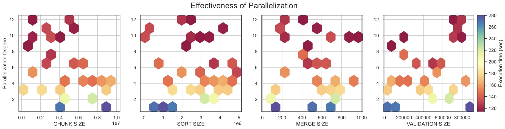

# Hyperparameter Optimization
To utilize the full potential of _SPIND_, we will search for the best performing set of hyperparameter. The execution relies on four user chosen parameters.`CHUNK_SIZE`, `MERGE_SIZE`, `SORT_SIZE` and `VALIDATION_SIZE`. Additionally, the `PARALLEL` degree can be set globally for the execution.

## Parameter Bounds
- `CHUNK_SIZE` is lower bounded by 10.000 to avoid the creation of massive amounts of files. The upper bound will be 100mil since we already showed that the creation of chunks generally improves performance.
- `MERGE_SIZE` is lower bounded by 2 for obvious reasons. The upper bound will be 1.000 to avoid exceeding the os systems capability of opening files.
- `SORT_SIZE` is upper bounded by your main memory. For my system I will limit it to 5mil. The lower bound is again 10.000 analog to `CHUNK_SIZE`.
- `VALIDATION_SIZE` is lower bounded by 1, representing iterative validation without parallelization and upper bounded by your main memory. Here the memory is exhausted faster, if the dataset has a lot of relations. To be safe, I set the upper bound to 1mil.
- `PARALLEL` is lower bounded by 1 and upper bounded by the number of threads of the machines CPU. In my case that's 12.

## Optimization Procedure
We will use Bayesian Optimization to efficiently find well performing parameters. The notebook [📘bayesian.ipynb](./bayesian.ipynb) includes code and documentation on how the optimization we executed.

## Observations
Find the raw results in [📂data](./data/). After the first optimization run it became clear, that the parallelization degree is the major decider for the execution speed. This is expected but was not proven to this point.

The plot uses data collected from the data.gov dataset where the n-ary search is limited to three layers. It shows that regardless of the other four parameters, we always find the clear trend that a higher degree of parallelization decreases the execution time. In further optimization runs we will therefore fix the parallelization degree to 12 (the maximum for my machine).