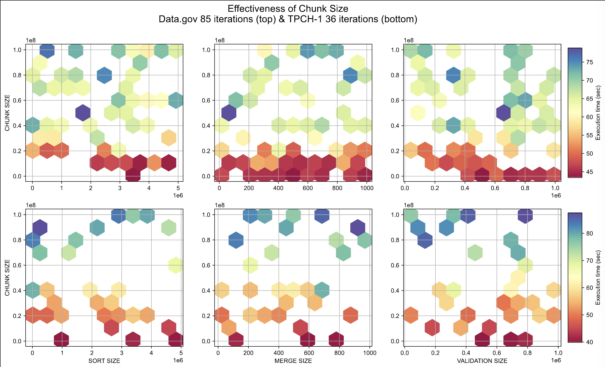
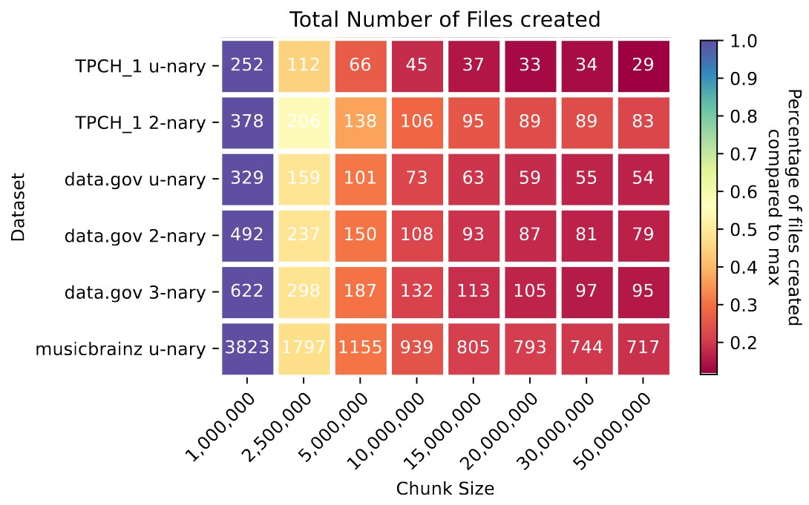
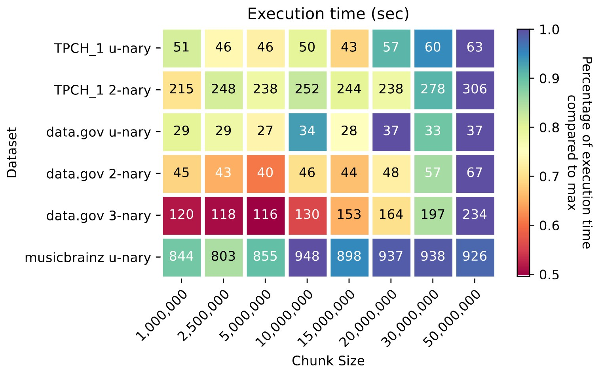

# Hyperparameter Optimization
To utilize the full potential of _SPIND_, we will search for the best performing set of hyperparameter. The execution relies on four user chosen parameters.`CHUNK_SIZE`, `MERGE_SIZE`, `SORT_SIZE` and `VALIDATION_SIZE`. Additionally, the `PARALLEL` degree can be set globally for the execution.

## Parameter Bounds
- `CHUNK_SIZE` is lower bounded by 10.000 to avoid the creation of massive amounts of files. The upper bound will be 100mil since we already showed that the creation of chunks generally improves performance.
- `MERGE_SIZE` is lower bounded by 2 for obvious reasons. The upper bound will be 1.000 to avoid exceeding the os systems capability of opening files.
- `SORT_SIZE` is upper bounded by your main memory. For my system I will limit it to 5mil. The lower bound is again 10.000 analog to `CHUNK_SIZE`.
- `VALIDATION_SIZE` is lower bounded by 1, representing iterative validation without parallelization and upper bounded by your main memory. Here the memory is exhausted faster, if the dataset has a lot of relations. To be safe, I set the upper bound to 1mil.
- `PARALLEL` is lower bounded by 1 and upper bounded by the number of threads of the machines CPU. In my case that's 12.

## Optimization Procedure
We will use Bayesian Optimization to efficiently find well performing parameters. The notebook [📘bayesian.ipynb](./bayesian.ipynb) includes code and documentation on how the optimization we executed.

## Observations
Find the raw results in [🗂️data](./data/). After the first optimization run it became clear, that the parallelization degree is the major decider for the execution time. This is expected but was not proven to this point.

Within the subplots of the figure, the y-axis of the subplots always resemble the parallelization degree. The x-axis refer to the different [parameters of _SPIND_](https://github.com/Jakob-L-M/spind/blob/main/README.md). The plot uses data from the [data.gov dataset](https://github.com/Jakob-L-M/partial-inclusion-dependencies/tree/main/data/data.gov) where the n-ary search is limited to three layers. It shows that regardless of the other four parameters, we always find the clear trend that a higher degree of parallelization decreases the execution time. In further optimization runs we will therefore fix the parallelization degree to 12 (the maximum for my machine).

With the parallelization set to its maximum, the second iterations yielded a rather unexpected result. The next most influential hyperparameter is the chunk size. We find, that the chunk size should be rather small and finds its maximum at roughly 10mil. An interpretation for this result is, that splitting large relations into more manageable chunks increases our capability of utilizing parallelization.

Even though we create more files at first, it seems these files would otherwise be spilled during the sorting phase. Once we start merging files, the total number of files did not chance much. Find the graphic below showing a heatmap with the total number of created files under changing chunk sizes in different datasets. The data was gathered using a sort size of 4mil and merge size of 500. To further set the displayed number into perspective, 
TODO: values for pBINDER and pSPIDER

Observing the plots, we find the total number of files created to always strictly decrease with an increased chunk size. This decrease is non-linear and is significantly decreased once the chunk size surpasses five million. The execution time is positively effected by a smaller chunk size, as we already learned. There is however a point at which this trend is inverted. For the compared datasets with varying max n-ary layers, we find that a chunk size of five million yields the best results overall. We fix the chunk size to five million going forward.